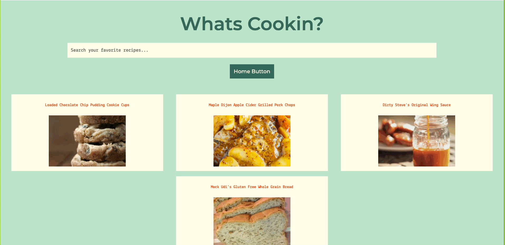

# What's Cookin'?

## Overview

In the mood to cook, but don't know what to make? What's Cookin is an application which allows users to access a recipe repository. Users can search recipes based on name or type of meal, and add those recipes either to a list of favorites or to a list of recipes to cook.

This application was created by Nikki Balmoori, Rachel Hill and Oakley Windiate during our second module of the Front-End Engineering program at Turing School of Software & Design. The spec for this project can be found [here](https://frontend.turing.edu/projects/whats-cookin-part-one.html).

## How to Use

To access the application locally:
- Clone the repository to your local machine
- `cd` into the application
- Run `npm install` to install the project dependencies
- Run `npm start` to run the local server to see the HTML page
  - Paste `http://localhost:8080/` into your browser to view the HTML page
  - If you need to stop running the local server, run `Control + C`
- To view tests, run `npm test`

## Application in Action
- View a list of all recipes, click on a recipe of interest, and favorite a recipe from the main page.

- Search the entire list of recipes by a recipe name or by a recipe tag (ex: appetizer, dinner, lunch, snack, etc.)

- Search your favorite recipes for a particular one you are looking to cook.

- In addition to favoriting recipes, you can also add recipes to cook using the plus button next to the favorite heart button.

## Technologies Used
- JavaScript
- CSS
- HTML
- Test Driven Development using Mocha & Chai

## Contributors
- [Nikki Balmoori](https://github.com/nbalmoori)
- [Rachel Hill](https://github.com/rachellhill)
- [Oakley Windiate](https://github.com/oakleywindiate)

## Challenges & Wins
- This was our first experience building processes with <b>Webpack</b>
- It was also our first experience implementing <b>fetch API</b> to access remote data
- We gained experience with <b>Test Driven Development</b> by writing tests
- We also gained experience <b>collaborating</b> with other developers, ensuring the learning and development of each group member
